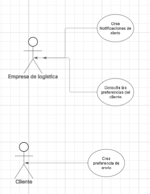

# Parcial-Corte-1-CVDS-DOSW
Parcial del Corte 1

## Integrantes:
- juan Pablo Nieto Cortes

---

## maven corriendo bien

## Maven Test

---
## Punto del Parcial:

### Punto 1

1. Identifique por medio de un diagrama de contexto las generalidades de su
sistema.

entonces la enpresa necesita enviar notificaciones por distintos medios a preferencia del cliente y si es critico o no

---

### Punto 2

2. Establezca las funcionalidades presentes en el caso de estudio y desarrolle
un diagrama de casos de uso.

- la empresa quiere crear notificaciones de alerta para poder notificar a sus clientes 
- la empresa quiere ver las preferencias de envio de sus clientes para poder enviar las notificasiones de alerta
- el cliente quiere crear una preferencia de envio para poder que la empresa le envie sus notificaciones de alerta

