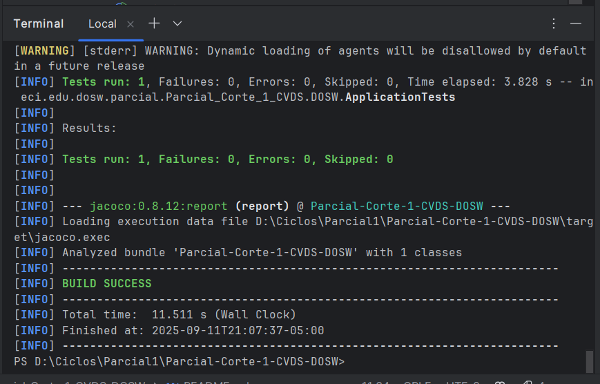
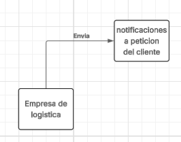

# Parcial-Corte-1-CVDS-DOSW
Parcial del Corte 1

## Integrantes:
- juan Pablo Nieto Cortes

---

## maven corriendo bien

## Maven Test

---
## Punto del Parcial:
1. Identifique por medio de un diagrama de contexto las generalidades de su
sistema.

entonces la enpresa necesita enviar notificaciones por distintos medios a preferencia del cliente y si es critico o no
